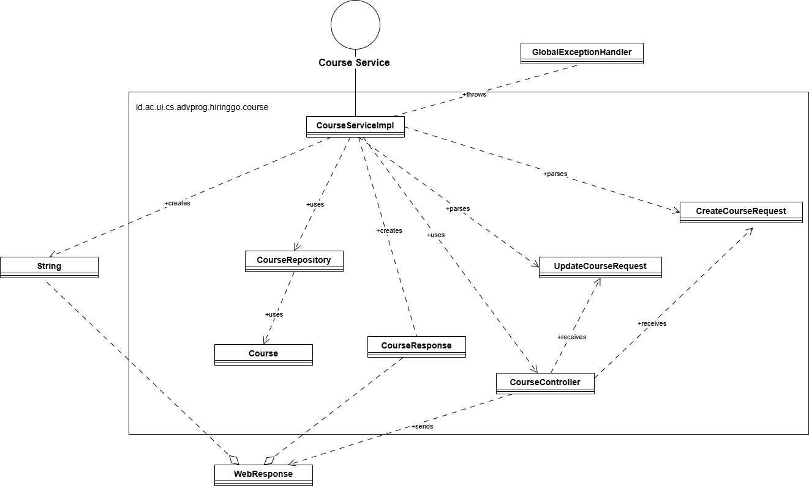
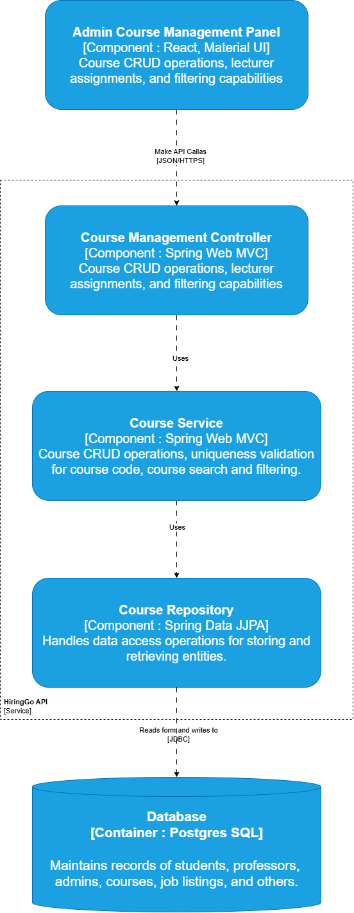

# HiringGo-Course

# Implementasi High-Level Networking : REST API dengan Spring Boot

Proyek ini menggunakan **REST API berbasis Spring Boot** untuk membangun komunikasi jaringan tingkat tinggi (High-Level Networking). Berikut adalah beberapa alasan utama mengapa saya memilih teknologi ini:

## 1. **Mudah Dikembangkan**

Spring Boot menyediakan pengaturan otomatis dan konfigurasi minimal untuk membangun aplikasi berbasis REST API. Dengan menggunakan Spring Boot, pengembangan aplikasi menjadi lebih cepat dan efisien, karena sebagian besar konfigurasi sudah tersedia dan mudah disesuaikan. Penggunaan Spring Boot juga memudahkan dalam pemeliharaan dan pengembangan aplikasi ke depannya.

## 2. **Aman (Otorisasi Berbasis Role)**

Keamanan merupakan prioritas utama dalam pengembangan aplikasi modern. Dengan menggunakan Spring Security yang terintegrasi dengan Spring Boot, saya dapat dengan mudah menambahkan otorisasi berbasis role. Ini memastikan bahwa hanya pengguna yang berwenang yang dapat mengakses endpoint tertentu dalam aplikasi, meningkatkan keamanan dan mencegah akses yang tidak sah.

## 3. **Dapat Diuji**

REST API yang dibangun dengan Spring Boot mendukung pengujian otomatis dengan alat seperti JUnit dan Mockito. Spring Boot menyediakan framework pengujian yang kuat untuk memastikan bahwa setiap bagian dari aplikasi dapat diuji dengan mudah, mulai dari controller hingga lapisan layanan dan repositori. Ini membantu meningkatkan kualitas dan stabilitas aplikasi selama pengembangan.

## 4. **Scalable dan Fleksibel**

REST API dengan Spring Boot sangat scalable dan fleksibel, memungkinkan aplikasi untuk menangani volume permintaan yang besar. Dengan arsitektur berbasis REST, aplikasi dapat dengan mudah berinteraksi dengan berbagai platform dan layanan lain, serta mendukung kebutuhan untuk skalabilitas horizontal (menambah lebih banyak server) tanpa kesulitan.

## Kesimpulan

Dengan menggunakan Spring Boot dan REST API, saya membangun aplikasi yang mudah dikembangkan, aman, dapat diuji, serta scalable dan fleksibel. Teknologi ini membantu dalam menciptakan solusi jaringan yang efisien dan dapat dengan mudah beradaptasi dengan kebutuhan aplikasi yang berkembang.

## Code Diagram Course

## Component Diagram Course

